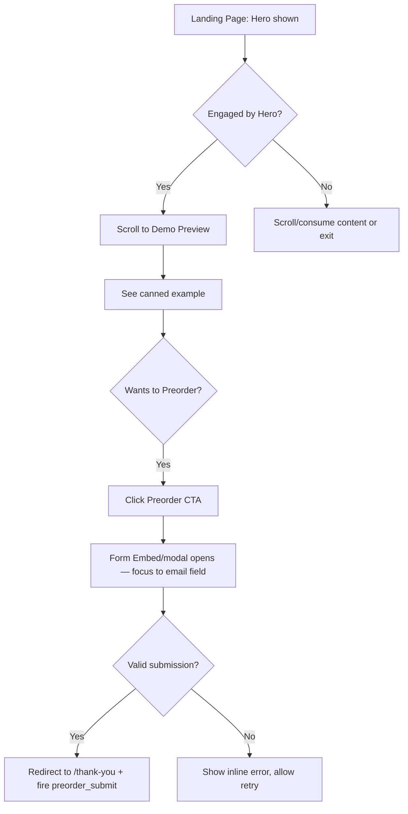
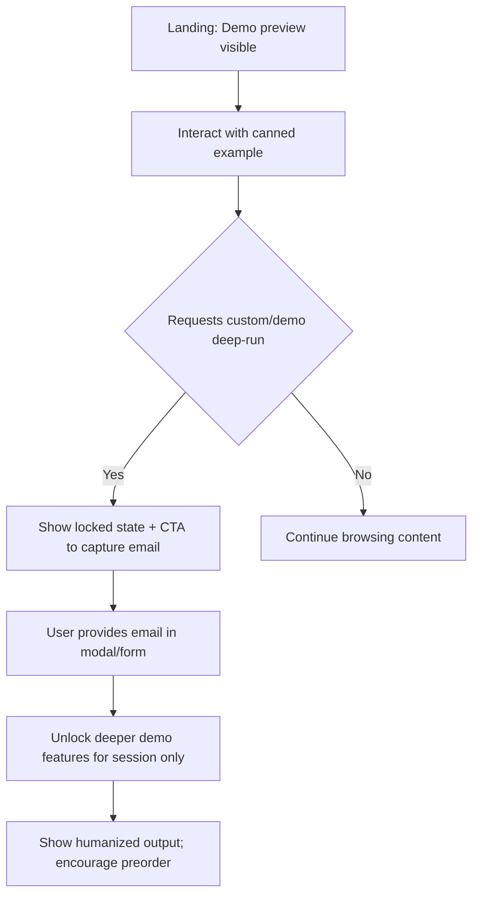

# UX Design Specification — EZDriveSite

**Author:** Ashton
**Date:** 2026-05-14

---

Welcome Ashton — I've initialized the UX design specification and loaded these input documents:

- PRD: _bmad-output/planning-artifacts/prd.md
- Product brief: _bmad-output/product-brief.md
- Project context: _bmad-output/project-context.md
- Epics: _bmad-output/planning-artifacts/epics.md

Please confirm if you'd like to add any more documents, or reply `C` to continue to discovery.

## Step 2 — Discovery (Executive Summary)

### Executive Summary

Project: EZDriveSite — single-page marketing site to capture preorder interest for an OBD-II device + app aimed at parents of young drivers.

### Key Insights from Loaded Documents
- Purpose: validate demand and capture preorders via an embedded Google Form (Product Brief).
- Audience: primary = parents of young drivers; tone family-first, reassuring (Product Brief).
- Core flows: Hero with `Preorder` CTA → embedded Google Form → `/thank-you` confirmation for GA4 conversion (PRD, Product Brief).
- UX scope: hero, benefit cards, how-it-works, demo widget (canned examples), preorder form with privacy note, privacy page, and `/thank-you` page (Epics and PRD).
- Constraints & tech rules: Next.js + Tailwind, JavaScript-only, performance & accessibility budgets (project-context.md).
- Analytics: GA4 required; fire `preorder_submit` on `/thank-you` and avoid sending PII (Epics/PRD).
- Performance & accessibility targets: Lighthouse ≥80 desktop, WCAG 2.1 AA for key flows; 3D visuals must lazy-load and have static fallbacks (PRD/Epics).

### Target Users
- Parents of young drivers (safety-conscious, non-technical). Secondary: early adopters of vehicle-health tools.

### Key Design Challenges
- Ensuring the embedded Google Form feels integrated, accessible, and trustworthy on mobile.
- Preserving performance with heavy 3D visuals — require lazy-loading and static fallbacks.
- Conveying privacy clearly near the form so users trust providing email.
- Gating interactive demo features behind email capture without degrading first-time engagement.

### Design Opportunities
- High-conversion hero + clear privacy note can increase signups rapidly.
- Canned demo examples can showcase product value without accepting PII or device data.
- Small A/B tests on CTA copy and hero microcopy can yield quick lift in conversion.

### Files Loaded
- `/_bmad-output/planning-artifacts/prd.md`
- `/_bmad-output/product-brief.md`
- `/_bmad-output/project-context.md`
- `/_bmad-output/planning-artifacts/epics.md`

## Step 3 — Core User Experience

### Defining Experience
Primary action: a visitor sees a clear hero message and clicks the `Preorder` CTA to provide an email (optional name) via an embedded form; successful submission leads to a `/thank-you` confirmation that records a non‑PII GA4 conversion. The experience must feel immediate, trustworthy, and minimal-friction for parents on mobile.

### Platform Strategy
- Platform: Web (Next.js) — mobile-first responsive design.
- Interaction modes: touch primary, keyboard focusable for accessibility.
- No offline requirements; prefer static-generation (SSG) for pages and lazy hydration for heavy visuals.
- Integrations: Google Form embed for MVP; GA4 via `NEXT_PUBLIC_GA_MEASUREMENT_ID`; optional `pages/api/signup.js` post‑MVP.

### Effortless Interactions
- Hero → Preorder CTA must reveal/focus form and accept submission within 1–2 taps.
- Embedded form should appear integrated (accessible title, focus management) and include concise privacy note.
- `/thank-you` must clearly confirm success and trigger `preorder_submit` event (no PII).
- Demo widget should show canned examples immediately; deeper input gated behind email capture.

### Critical Success Moments
- First impression: user immediately understands value and sees an above‑the‑fold CTA.
- Form submission: success and clear confirmation (make-or-break for perceived trust).
- Privacy reassurance: visible, readable privacy note beside form.
- Demo reveal: user perceives product value from canned examples without giving PII.

### Experience Principles
- Clarity First: single CTA, concise copy, obvious next step.
- Trust & Privacy: always show privacy note; never send email/PII to analytics.
- Performance-First: lazy-load 3D; static fallbacks; keep initial JS small.
- Progressive Enhancement: core flows work without heavy JS; extras load after interaction.
- Accessibility Everywhere: keyboard focus, ARIA labels, WCAG 2.1 AA for core flows.
- Measured & Testable: include data-layer attributes for A/B testing and `preorder_submit` hooks.

## Step 6 — Design System Foundation

### Design System Choice
Recommendation: Use a Themeable System built on Tailwind CSS (already in project) combined with accessible primitives (Headless UI or Radix) and a small set of custom, documented components.

### Rationale for Selection
- Matches existing repo: Tailwind is already used in the project and fits the project's JavaScript-only policy.
- Performance-first: Tailwind produces small runtime overhead and supports utility-driven, easily-audited CSS; avoids heavy component frameworks that increase initial bundle sizes.
- Accessibility: Headless UI / Radix provide accessible primitives so custom components can focus on styling and behavior while preserving ARIA and keyboard patterns.
- Speed & Maintenance: Enables rapid development for MVP while leaving room to evolve into a fuller design system later.

### Implementation Approach
1. Define design tokens in `tailwind.config.js` (colors, spacing, radii, type scale) and expose a small `design-tokens.md` in `docs/`.
2. Add `components/ui/` for shared, themeable components: `Button`, `Hero`, `FormEmbed`, `Modal`, `ThreeDFallback`, `AnalyticsHooks` wrappers.
3. Use Headless UI or Radix for primitives (dialog, disclosure, listbox) and style via Tailwind classes to keep accessibility robust.
4. Keep 3D canvas and heavy visuals in dynamically-imported components; provide a `ThreeDFallback` static image component to render immediately.
5. Add a lightweight `ui/README.md` documenting usage, accessibility rules, and token overrides.

### Customization Strategy
- Centralize tokens in `tailwind.config.js` and document variant tokens (brand, accent, success, warning) to allow marketing A/B variants via data attributes (`data-ab-variant`).
- Keep components presentational only; accept behavior hooks from page code to preserve separation of concerns.
- Ship a minimal set of components for MVP (Hero, Button, FormEmbed, ThankYou, DemoPreview) and expand iteratively based on needs.

### Next Steps
- Create `docs/design-tokens.md` and scaffold `components/ui/Button.js` and `components/ui/FormEmbed.js` as first deliverables.
- Ensure accessibility testing (axe) is included in CI for new components.

## Step 7 — Defining Core Experience

### 7.1 Defining Experience
The single defining experience: a parent lands on the page, quickly understands value, taps the `Preorder` CTA, and completes a minimal email capture flow (embedded Google Form or accessible modal) within 1–2 interactions — seeing immediate, plain‑English proof of value via a canned demo and a clear `/thank-you` confirmation that sets expectations.

### 7.2 User Mental Model
Users expect a simple marketing flow: clear benefit → easy signup → confirmation. They compare this to other family-safety apps and expect reassurance, privacy, and straightforward next steps rather than technical detail.

### 7.3 Success Criteria
- Time-to-signup ≤ 30s for mobile users from first viewport.
- Embedded form is keyboard-accessible and focus-managed (tab lands in form).
- `/thank-you` fires `preorder_submit` GA4 event with non‑PII params.
- Demo communicates core value in ≤ 10s without user input.

### 7.4 Novel UX Patterns
- Use of a canned-demo preview inline with hero (proven pattern) but gated deeper interaction behind email capture (novel combination for trust-building).
- Data-attribute driven A/B hooks (`data-ab-variant`) to enable copy/CTA experiments without code changes.

### 7.5 Experience Mechanics
1. Initiation:
  - Hero shows headline, subcopy, and `Preorder` CTA with `data-cta-id`.
  - CTA scrolls to form section or opens accessible modal; focus moves to first field.
2. Interaction:
  - Form is an accessible iframe/embed or lightweight modal form (`email` required, `name` optional).
  - Show a concise privacy note adjacent to the form with link to `/privacy`.
  - Provide inline validation and non-blocking error messages.
3. Feedback:
  - On successful submission, redirect or show `/thank-you`; fire `preorder_submit` with `{ variant, utm_campaign }`.
  - On failure, show friendly retry instructions and `form_submission_failure` event (non-PII).
4. Completion:
  - `/thank-you` confirms next steps and expected email cadence; includes share CTA and links to privacy.
  - Record conversion timestamp in client logs (no PII).

## Step 8 — Visual Design Foundation

### Color System
Recommendation: a calm, trust-forward palette with clear semantic roles.
- Primary: `#0F766E` (Teal-700) — trust/brand accent.
- Accent: `#06B6D4` (Cyan-400) — highlights and micro-interactions.
- Success: `#16A34A` (Green-600).
- Warning: `#F59E0B` (Amber-500).
- Error: `#DC2626` (Red-600).
- Neutral background: `#FFFFFF` (white) and `#F8FAFC` (gray-50) for surfaces.
- Text primary: `#0F172A` (Slate-900); muted text: `#475569` (Slate-600).

Semantic usage: map tokens in `tailwind.config.js` (e.g., `--color-primary`, `--color-accent`, `--color-bg`, `--color-text`) and ensure accessible contrast (AA minimum for body text; aim for AAA on hero headings where practical).

### Typography System
Recommendation: use a modern, readable system font stack for performance and accessibility, with `Inter` as optional enhancement.
- Font stack: `Inter, system-ui, -apple-system, 'Segoe UI', Roboto, 'Helvetica Neue', Arial`.
- Type scale (desktop baseline):
  - H1: 36px / 44px line-height
  - H2: 28px / 36px
  - H3: 20px / 28px
  - Body: 16px / 24px
  - Small: 14px / 20px

Apply responsive variants via Tailwind (e.g., `text-2xl sm:text-3xl`), and ensure minimum font-size 16px on mobile for readability.

### Spacing & Layout Foundation
- Base spacing unit: 8px (Tailwind `space-x-2` / `gap-2` semantics). Use multiples of 8 for consistent rhythm.
- Grid: 12-column responsive grid with breakpoints `sm` (640px), `md` (768px), `lg` (1024px). Mobile-first single column, two-column for content blocks ≥ `md`.
- Component padding suggestions: small (8–12px), medium (16–24px), large (32–48px) to create clear visual hierarchy.

### Accessibility Considerations
- Ensure contrast ratio ≥ 4.5:1 for body text and ≥ 3:1 for large text; test hero heading contrast for readability.
- Focus styles: visible 2px focus ring using `outline` or `ring-2 ring-offset-2` Tailwind utilities with `--color-accent` for keyboard users.
- Color usage: never rely on color alone to convey state; include icons or text labels for success/error states.
- Images & 3D: provide descriptive `alt` text and accessible captions; ensure `ThreeDFallback` static images have `alt` and `aria-hidden` when decorative.

### Deliverables & Implementation Notes
- Export semantic tokens into `tailwind.config.js` and add `docs/design-tokens.md` documenting usage and examples.
- Create `components/ui/ThemePreview.js` (dev-only) to visualize color/typography combos for stakeholder review.
- Add a11y checks (axe) to CI for visual regressions and contrast violations.

## Step 5 — UX Pattern Analysis & Inspiration

### Inspiring Products Analysis
- Life360: strong family-first onboarding, clear location/alerting metaphors, reassurance-focused copy. Good model for trust-building and clear privacy affordances.
- Apple Health / Apple Wallet: calm, minimal visuals and progressive disclosure of detail — useful for showing critical info clearly without overwhelming users.
- Intercom / Drift landing experiences: focused CTAs and concise microcopy designed to convert; helpful pattern for hero → CTA clarity and conversion scaffolding.

### Transferable UX Patterns
- Single prominent CTA with clear microcopy and simple next-step flow (hero → immediate action).
- Progressive disclosure for demos: show canned examples upfront, gate custom input behind capture.
- Inline privacy affordance: short privacy note adjacent to form with a link to full policy.
- Lightweight motion: smooth scroll-to-form and subtle reveals to communicate polish without harming performance.

### Anti-Patterns to Avoid
- Embedding heavy, non-responsive iframes that break on mobile or are not keyboard accessible.
- Overloading the hero with too many choices or CTAs (reduces conversion).
- Sending PII to analytics or firing events with email content.

### Design Inspiration Strategy
- Adopt: single-CTA hero, privacy-adjacent microcopy, and canned-demo pattern for value proof.
- Adapt: visual tone from family-focused apps (muted colors, reassuring illustrations) simplified for fast load times.
- Avoid: complex modals or heavy 3D as the only way to convey value; always provide a static fallback and an accessible iframe alternative.

## Step 9 — Design Direction Mockups

### Design Directions Explored (summary)
I propose generating 6 design direction mockups focusing on: layout variants (dense vs. airy), hero emphasis styles (visual-heavy 3D vs. clean illustrative), CTA prominence strategies (fixed CTA vs. inline), demo presentation (inline canned preview vs. modal), and privacy affordance placement.

### Chosen Direction (recommended for MVP)
Recommendation: Start with a clean, airy layout that prioritizes a single prominent hero CTA, an inline canned-demo preview (static image with a small play/preview), and a clearly visible privacy note next to the form. Use the Teal primary palette and the Tailwind-based tokens for consistent spacing.

### Design Rationale
- Maximizes conversion by reducing choices and surfacing the CTA above the fold.
- Airy layout supports scanning and builds trust for parent audience.
- Inline canned-demo gives immediate proof-of-value without requiring user input; deeper interaction gated behind email.
- Accessibility and performance preserved by using static fallback imagery and lazy-loading heavy visuals.

### Implementation Approach
1. Generate an HTML showcase `/_bmad-output/planning-artifacts/ux-design-directions.html` with 6 mockups (dev-only artifact).
2. Implement MVP templates for the chosen direction: `components/Hero.js`, `components/FormEmbed.js`, `components/DemoPreview.js`, `pages/thank-you.js`.
3. Wire `data-ab-variant` attributes for CTA and hero to support marketing experiments.
4. Review mockups with stakeholders and iterate—combine elements from other directions if desired.

## Step 10 — User Journey Flows

### Journey 1: Discover → Preorder (Primary conversion flow)

Description: A parent lands on the home page, understands the value from hero + canned demo, clicks `Preorder`, completes the email capture, and receives a `/thank-you` confirmation.

Mermaid diagram:



Success criteria:
- Time-to-signup ≤ 30s from first viewport on mobile.
- GA4 `preorder_submit` fired on `/thank-you` with non-PII params.

### Journey 2: Demo Exploration → Gate → Capture

Description: Visitor interacts with a canned demo inline; attempts deeper interaction => prompted to capture email to unlock more demo features.

Mermaid diagram:



Success criteria:
- Demo communicates product value in ≤ 10s.
- Locked path converts at target rate (monitor `demo_unlock` event).

### Journey 3: Post-Submit Flow & Follow-up

Description: After submission, the user sees `/thank-you`, receives follow-up email, and is nudged back to share or learn more.

Mermaid diagram:

```mermaid
flowchart TD
  A[User hits /thank-you] --> B[Show confirmation copy + next steps]
  B --> C[Fire preorder_submit GA4 event]
  C --> D[Send follow-up email (marketing system)]
  D --> E[User receives timeline + share CTA]
  E --> F[User shares or returns to site]
```

Success criteria:
- `/thank-you` displays next steps and expected email cadence.
- Follow-up open rate target >= 25% (tracked outside UX spec).

### Journey Patterns
- Entry points: hero CTA, inline demo, footer CTA.
- Decision points: demo depth, preorder intent, error recovery on form.
- Feedback patterns: inline validation, success redirect, analytics events (`cta_click`, `demo_unlock`, `preorder_submit`, `form_submission_failure`).

### Flow Optimization Principles
- Minimize steps to core value; keep hero simple and CTA single-minded.
- Surface privacy & trust signals at point of capture.
- Provide immediate, useful demo output before requiring PII.
- Graceful error handling with clear retry paths and telemetry for failures.

## Step 11 — Component Strategy

### Analysis: Design System Coverage

Design system foundation: Tailwind CSS + accessible primitives (Headless UI / Radix) per Step 6.

Available from chosen system:
- Utility classes for layout, spacing, and tokens (Tailwind)
- Accessible primitives (dialog, listbox) via Headless UI / Radix (recommended)

Gaps for EZDriveSite (based on user journeys):
- Integrated, themeable `Button` with analytics hooks and accessible focus styles
- `FormEmbed` wrapper to integrate and focus-manage the Google Form embed (iframe/modal)
- `Hero` component combining headline, microcopy, and primary CTA
- `DemoPreview` component for canned demo + unlock gating
- Lightweight `ThreeDFallback` and `DemoModal` patterns for lazy-loaded 3D

### Custom Components (MVP)

#### `Button`
Purpose: primary action control across the site (CTA, form submit, demo unlock).
Usage: contained primary, subtle secondary variants.
States: default, hover, active, focus, disabled.
Accessibility: `aria-pressed` where applicable; visible focus ring; keyboard operable.

#### `FormEmbed`
Purpose: host the Google Form in an accessible, focus-managed container (inline or modal).
Usage: used for preorder capture and any gated demo unlocks.
States: loading, error, success.
Accessibility: iframe `title`, focus trap in modal mode, provide skip links for keyboard users.

#### `Hero`
Purpose: above-the-fold message and single primary CTA that drives conversion.
Usage: homepage hero with `data-cta-id` and an actionable `onPreorder` handler.
Accessibility: semantic heading structure, clear focus path to CTA.

#### `DemoPreview`
Purpose: show canned demo value quickly; allow unlocking deeper demo after email capture.
Usage: inline preview with `Unlock demo` action that triggers capture flow.
Accessibility: ensure demo is reachable by keyboard and clearly labeled.

### Component Specification Template

For each custom component we will include:
- Purpose
- Usage
- Anatomy
- States
- Variants
- Accessibility
- Content guidelines
- Interaction behavior

### Implementation Strategy

- Build custom components using Tailwind tokens defined in `tailwind.config.js`.
- Use Headless UI / Radix primitives for complex interactions (dialog/focus trap).
- Keep components presentational — pass behavior hooks from pages (`onPreorder`, `onUnlock`).
- Lazy-load heavy visuals (3D) with `dynamic()` imports in Next.js and provide `ThreeDFallback` images.
- Add analytics hooks in a small `lib/analytics.js` wrapper to fire `cta_click`, `demo_unlock`, `preorder_submit`, `form_submission_failure`.

### Implementation Roadmap (MVP-first)

Phase 1 — Core components (MVP):
- `Button` — required for all CTAs
- `FormEmbed` — integrate Google Form with focus management
- `Hero` — shipped on homepage
- `DemoPreview` — canned demo preview to show value
- `/thank-you` page — confirmation and `preorder_submit` hook

Phase 2 — Supporting components:
- `Modal`/`Dialog` (Headless UI wrapper)
- `ThreeDFallback` and lazy-loaded `ThreeDCanvas`
- `AnalyticsHooks` and data-layer attributes

Phase 3 — Enhancements:
- Theming utilities, ThemePreview dev page, more variants and tests

### Accessibility & QA

- Document ARIA patterns for `FormEmbed` and `Modal`.
- Add axe checks in CI for new components and critical pages.

### Append & Proceed

This content has been added to the UX Design Specification and saved. Next up: scaffold the Phase 1 component files for the MVP and create the `/thank-you` page.


